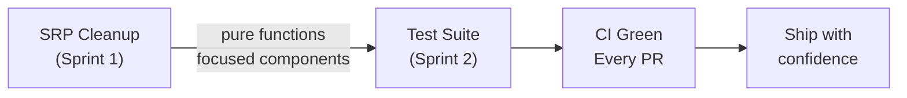
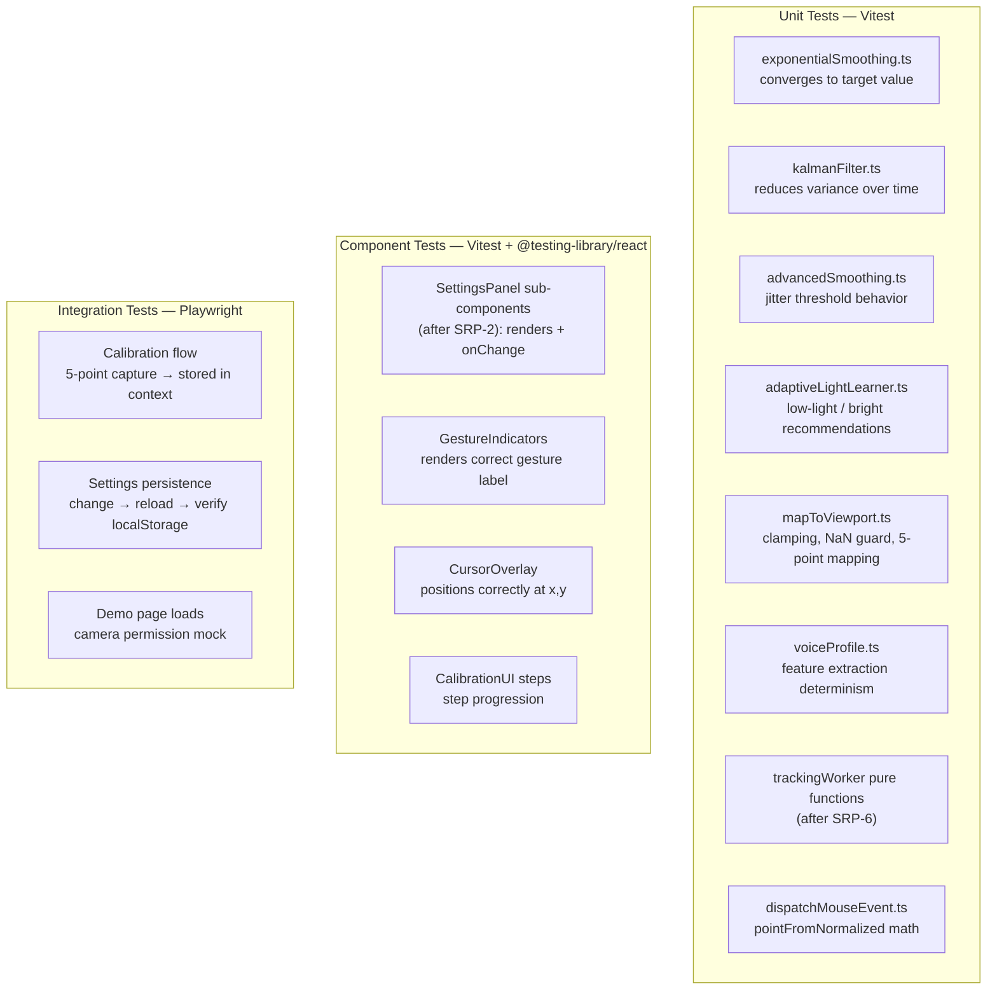

##  Priority: Next Sprint (requires SRP cleanup first)

NodCursor currently has **zero automated tests**. The SRP cleanup sprint (SRP-1 through SRP-6) is a prerequisite because isolated, pure functions and focused components are far easier to unit-test than 400+ line monoliths.

---

## Why Now?

---

## Previous Work Referenced

- **Issue #2** (@SanPranav, Task B): *"Validate default thresholds… If you change thresholds, document the rationale."* — tests would encode this validation automatically, replacing manual rationale notes.
- **Issue #4** (Design Research): *"Performance Profiling — measure latency and jitter across device/camera configurations."* — automated tests can guard against performance regressions.
- **Commit `0be341b`** (@SanPranav + @aadibhat09): threshold tuning commit — if automated tests had existed, this would have been caught by a failing test rather than requiring manual validation.

---

## Proposed Test Strategy

---

## Recommended Stack

| Tool | Purpose |
|------|---------|
| `vitest` | Fast unit + component test runner (Vite-native) |
| `@testing-library/react` | Component testing |
| `@testing-library/user-event` | User interaction simulation |
| `jsdom` | Browser DOM simulation for unit tests |
| `playwright` | End-to-end integration tests |
| `@vitest/coverage-v8` | Coverage reporting |

---

## Acceptance Criteria

- [ ] `vitest` added to `devDependencies`; `npm run test` runs all unit + component tests
- [ ] Test coverage ≥ 60% for `src/utils/` (pure functions)
- [ ] `exponentialSmoothing`, `kalmanFilter`, `advancedSmoothing` have unit tests
- [ ] `adaptiveLightLearner` has unit tests for all three lighting recommendations
- [ ] `mapToViewport` has unit tests covering clamp and NaN guard cases
- [ ] At least one component test per major UI component
- [ ] CI (`ci.yml`) runs `npm run test` on every PR

---

**Labels:** `testing` `next-sprint` `dx` `quality`  
**Milestone:** Post-SRP Sprint — Q2 2026  
**Depends on:** SRP-1, SRP-2, SRP-3, SRP-6 (pure function extraction)  
**References:** [KANBAN_BOARD.md — NEXT-1](../../docs/KANBAN_BOARD.md#next-1-automated-test-suite)
