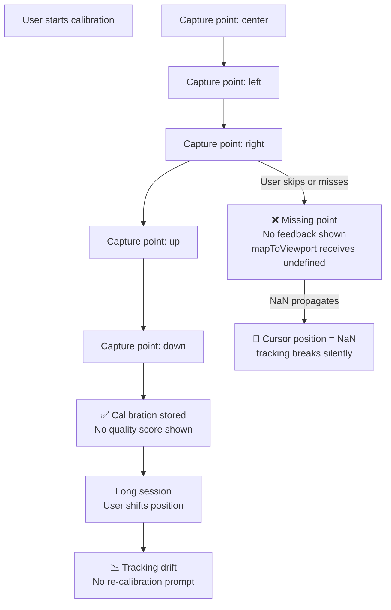

## 🔵 Priority: Next Sprint

The calibration system is functional but lacks guard rails for edge cases and quality feedback, as identified in both individual weekly issues and design research.

---

## Previous Work Referenced

- **Issue #2** (@SanPranav, Task C): *"Add/verify user feedback for incomplete calibration data (missing one of the capture points). Ensure mapping always clamps to [0..1] and avoids NaN/undefined cases."* — this issue fulfills that task.
- **Issue #4** (Design Research, Problem 3): *"Calibration Mapping — build re-calibration flow for mid-session drift correction."* and *"Design hypothesis: A 5-point calibration (~30 seconds) is acceptable; anything longer creates drop-off."*
- **Commit `395abcd`** (@SanPranav + @aadibhat09): `"add ML + fix calibration and cameras + develop better tracking default sens change"` — fixed several calibration issues but left the incomplete-capture UX and NaN guard unaddressed.

---

## Problem Breakdown



---

## Work Items

### 1. Incomplete Capture Feedback

- Show a clear error message if the user proceeds with fewer than 5 captured points
- Highlight which point(s) are missing in the calibration wizard UI
- Disable "Complete Calibration" button until all 5 points are captured

### 2. NaN Guard in `mapToViewport`

```typescript
// Ensure output is always [0, 1] with no NaN
// Current code may produce NaN if calibration bounds are equal (zero range)
function mapToViewport(raw: number, min: number, max: number): number {
  if (!isFinite(min) || !isFinite(max) || min === max) {
    return 0.5; // safe fallback to center
  }
  return Math.min(1, Math.max(0, (raw - min) / (max - min)));
}
```

### 3. Calibration Quality Score

After all 5 points are captured, compute and display a quality score:
- **Range score**: how wide the user's movement range is (wider = more precise control)
- **Symmetry score**: how symmetric left/right and up/down ranges are
- **Visual indicator**: green / yellow / red badge

### 4. Re-calibration Prompt for Drift

Detect significant drift using the adaptive light state (already built in `useFaceTracking.ts`). If the tracking confidence drops below a threshold for >10 seconds, surface a non-intrusive prompt: *"Your position may have changed — recalibrate?"*

---

## Acceptance Criteria

- [ ] Calibration wizard prevents completion with fewer than 5 captured points
- [ ] Missing points are visually highlighted in the step list
- [ ] `mapToViewport` never returns `NaN` or a value outside `[0, 1]`
- [ ] Calibration quality score displayed after successful capture
- [ ] Re-calibration prompt appears when confidence < 0.3 for > 10s
- [ ] Existing calibration data migration preserved (no loss on upgrade)

---

**Labels:** `ux` `calibration` `next-sprint` `accessibility`  
**Milestone:** Post-SRP Sprint — Q2 2026  
**References:** [KANBAN_BOARD.md — NEXT-2](../../docs/KANBAN_BOARD.md#next-2-calibration-ux-improvements)  
**Cited Issues:** #2 (SanPranav weekly), #4 (Design Research)
