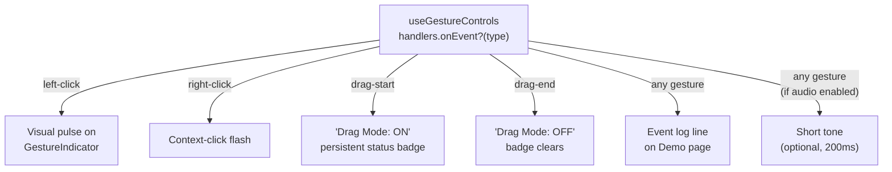

##  Priority: Next Sprint

Users have no confirmation that their gesture was registered. This creates anxiety — especially for users with motor impairments who may not be able to easily repeat a gesture if it wasn't detected. Adding visual and optional audio feedback closes this gap.

---

## Previous Work Referenced

- **Issue #3** (@aadibhat09, Task B): *"Add visible state indicators — 'Drag mode: On/Off', 'Gestures enabled: yes/no' (based on settings)"* and *"Improve accessibility affordances — larger click targets, clear focus ring styles, readable high-contrast UI cues."* — this issue delivers that task.
- **Issue #4** (Design Research): Design hypothesis #2: *"Users prefer gesture confirmation feedback (visual/audio) over silent action dispatch."* — validated by accessibility UX research.
- **Commit `7c3fb1d`** (@SanPranav + @aadibhat09): `"Nod cursor + voice cursor"` — added voice commands but did not add any confirmation feedback for voice gestures.
- **Commit `292ed89`** (@SanPranav + @aadibhat09): `"feat(typing): optimize mouth typing flow"` — mouth typing has its own indicator but gesture clicks have none.

---

## Feature Breakdown



---

## Design Specifications

### 1. GestureIndicator Pulse

When a gesture fires, the matching `GestureIndicator` component should pulse with a brief (200ms) highlight animation:

```
[  Blink ]  →  [  Blink  ] (200ms glow) → [  Blink ]
```

### 2. Drag Mode Badge

A persistent badge in the top-right corner of the Demo and Games pages:
- **Drag OFF** (default): no badge, or subtle grey indicator
- **Drag ON**: bright amber badge `" Drag: ON"` — clearly visible

### 3. Event Log (Demo Page)

The Demo page already has an `onEvent` callback path in `useGestureControls.ts` (`handlers?.onEvent?.(event)`). Surface this as a 3-line rolling log:

```
[12:34:05] left-click at (0.52, 0.48)
[12:34:07] blink detected
[12:34:09] drag-mode ON
```

### 4. Optional Audio Cue

A short 200ms tone (via `AudioContext`) played when any gesture fires, controlled by a new `gestureAudioEnabled` setting. Must be off by default to avoid startling users.

---

## Acceptance Criteria

- [ ] `GestureIndicators` component pulses for 200ms when the matching gesture fires
- [ ] Drag mode badge visible and correct on Demo and Games pages
- [ ] 3-line rolling event log shown on Demo page, populated via `onEvent` callback
- [ ] Optional audio cue added, gated by `gestureAudioEnabled` setting (off by default)
- [ ] New `gestureAudioEnabled` setting appears in `SettingsPanel` under a new "Feedback" section
- [ ] All feedback is visually accessible: high contrast, no color-only signals
- [ ] No performance impact at 30+ FPS — feedback hooks must not block the tracking loop

---

**Labels:** `ux` `gestures` `accessibility` `next-sprint`  
**Milestone:** Post-SRP Sprint — Q2 2026  
**References:** [KANBAN_BOARD.md — NEXT-3](../../docs/KANBAN_BOARD.md#next-3-gesture-confidence-feedback)  
**Cited Issues:** #3 (aadibhat09 weekly), #4 (Design Research)
