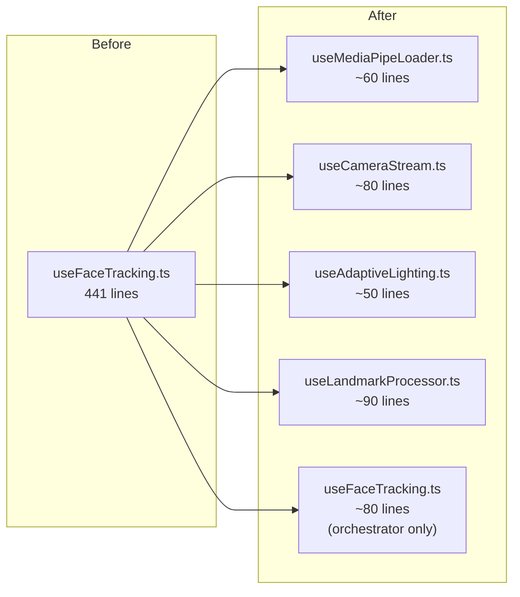

##  Priority: ASAP

`src/hooks/useFaceTracking.ts` is **441 lines** and handles **6 distinct responsibilities** — a critical SRP violation that makes the tracking pipeline hard to maintain, test, or extend.

---

## Problem Analysis

```mermaid
mindmap
  root((useFaceTracking.ts\n441 lines))
    MediaPipe Loading
      WASM CDN fallback chain
      FilesetResolver init
      FaceLandmarker model fetch
    Camera Management
      requestCameraStream()
      device enumeration
      camera error formatting
    Adaptive Lighting
      AdaptiveLightLearner
      tuneCameraForRecommendation()
      sampleVideoLuma() integration
    Landmark Extraction
      nose, eye, mouth ratios
      blinkRatio computation
      headTilt calculation
    Web Worker Coordination
      Worker lifecycle
      message passing
      state commit throttling
    Fallback Mouse Mode
      fallback state
      outlier detection
      confidence scoring
```

---

## Previous Work Referenced

- **Commit `395abcd`** (@SanPranav + @aadibhat09): `"add ML + fix calibration and cameras + develop better tracking default sens change"` — integrated `AdaptiveLightLearner` directly into `useFaceTracking.ts` (lines 6, 73–110), adding a 6th concern to an already large hook.
- **Commit `0be341b`** (@SanPranav + @aadibhat09): `"feat(tracking): tune blink and gesture sensitivity behavior"` — deepened blink state configuration inside the same hook.

---

## Proposed Refactor



| New File | Responsibility |
|----------|---------------|
| `useMediaPipeLoader.ts` | Load MediaPipe WASM + model (CDN fallback chain) |
| `useCameraStream.ts` | Camera stream acquisition, device enumeration, error messages |
| `useAdaptiveLighting.ts` | `AdaptiveLightLearner` + `tuneCameraForRecommendation` |
| `useLandmarkProcessor.ts` | Landmark index extraction, ratio computation |
| `useFaceTracking.ts` | Thin orchestrator — composes the above hooks |

---

## Acceptance Criteria

- [ ] `useFaceTracking.ts` reduced to ≤ 100 lines (orchestrator only)
- [ ] `useMediaPipeLoader.ts` handles only MediaPipe WASM loading and CDN fallback
- [ ] `useCameraStream.ts` handles only camera stream acquisition + device enumeration
- [ ] `useAdaptiveLighting.ts` handles only adaptive lighting and camera tuning
- [ ] `useLandmarkProcessor.ts` handles only landmark index extraction and ratio computation
- [ ] All existing tracking behavior preserved — no regression
- [ ] Each new hook is independently importable and testable

---

**Labels:** `srp-cleanup` `refactor` `ASAP` `hooks`  
**Milestone:** SRP Cleanup Sprint — Q1 2026  
**References:** [KANBAN_BOARD.md — SRP-1](../../docs/KANBAN_BOARD.md#srp-1-split-usefacetrackingts)
