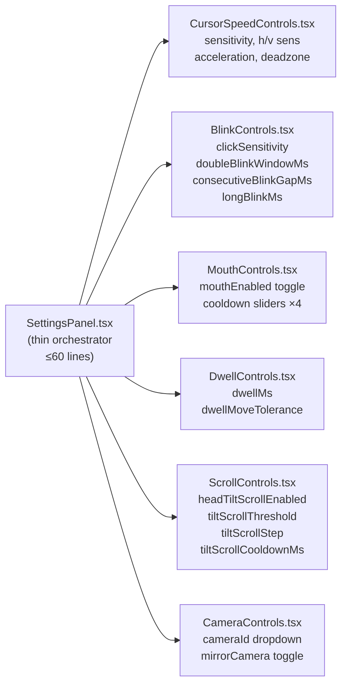

##  Priority: ASAP

`src/components/SettingsPanel/SettingsPanel.tsx` is **321 lines** that renders **40+ accessibility control sliders** in a single monolithic component. Any change to one settings group requires touching a file containing all other groups.

---

## Problem Analysis

```mermaid
block-beta
  columns 1
  block:PANEL["SettingsPanel.tsx — 321 lines — everything in one component"]:1
    A["Cursor Speed (sensitivity)"]
    B["Horizontal Sensitivity"]
    C["Vertical Sensitivity"]
    D["Acceleration Curve"]
    E["Smoothing Level"]
    F["Deadzone"]
    G["Dwell Timing (dwellMs, dwellMoveTolerance)"]
    H["Blink Parameters (clickSensitivity, doubleBlinkWindowMs,\nconsecutiveBlinkGapMs, longBlinkMs)"]
    I["Mouth Parameters (mouthEnabled, cooldowns ×4)"]
    J["Head Tilt Scroll (threshold, step, cooldown)"]
    K["Camera Selection Dropdown"]
    L["Mirror Camera Toggle"]
  end
```

---

## Previous Work Referenced

- **Commit `34906f6`** (@SanPranav + @aadibhat09): `"feat(ui): add advanced sensitivity controls and presets"` — added horizontal/vertical sensitivity sliders and acceleration curve, growing `SettingsPanel.tsx` by ~80 lines.
- **Commit `e101865`** (@SanPranav + @aadibhat09): `"feat(settings): add granular sensitivity data model"` — expanded `CursorSettings` to include `horizontalSensitivity`, `verticalSensitivity`, `acceleration`, increasing the number of renderable controls.
- **Issue #3** (@aadibhat09, Task C): *"Ensure toggles in Settings map to actual behavior in hooks… add short helper text explaining tradeoffs."* — easier to do per-section when components are focused.

---

## Proposed Decomposition

---

## Acceptance Criteria

- [ ] `SettingsPanel.tsx` reduced to ≤ 60 lines (renders sub-components only)
- [ ] `CursorSpeedControls.tsx` handles cursor speed, h/v sensitivity, acceleration, deadzone
- [ ] `BlinkControls.tsx` handles all 4 blink parameters + `blinkEnabled` toggle
- [ ] `MouthControls.tsx` handles `mouthEnabled` + mouth typing cooldown sliders
- [ ] `DwellControls.tsx` handles `dwellMs` + `dwellMoveTolerance`
- [ ] `ScrollControls.tsx` handles head tilt scroll parameters
- [ ] `CameraControls.tsx` handles camera selection dropdown + mirror toggle
- [ ] All settings still propagate correctly via `onChange` to `AppContext`
- [ ] Sub-components are individually importable and testable

---

**Labels:** `srp-cleanup` `refactor` `ASAP` `components` `ui`  
**Milestone:** SRP Cleanup Sprint — Q1 2026  
**References:** [KANBAN_BOARD.md — SRP-2](../../docs/KANBAN_BOARD.md#srp-2-decompose-settingspaneltsx)
