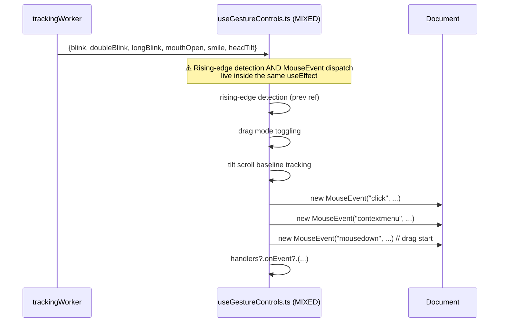
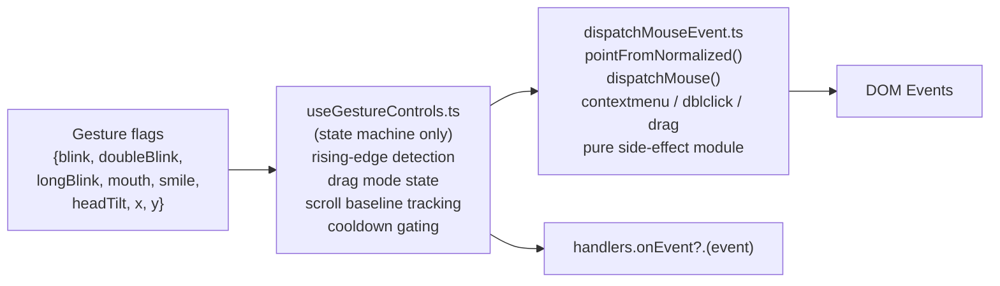

## 🔴 Priority: ASAP

`src/hooks/useGestureControls.ts` (177 lines) conflates **blink/gesture state machine tracking** with **DOM mouse event dispatching**. These are two very different concerns — state machines are testable pure logic; DOM dispatch is a side-effect layer.

---

## Problem Analysis

The dispatch helper `dispatchMouse()` (lines 26–46) is a DOM side-effect. It should live in a separate, mockable module so that the state machine logic can be unit-tested without a browser DOM.

---

## Previous Work Referenced

- **Commit `7ac89ed`** (@SanPranav + @aadibhat09): `"added mouth typing + gesture controls"` — original commit that created `useGestureControls.ts`, mixing state machine and dispatch from the start.
- **Issue #3** (@aadibhat09, Task A): *"Gesture dispatch hardening — ensure double blink detection does not cascade into repeated contextmenu fires; ensure long blink does not rapidly toggle drag mode."* — the hardening is easier after the separation since the state machine can be reasoned about independently.

---

## Proposed Extraction

| Module | Responsibility |
|--------|---------------|
| `useGestureControls.ts` | Rising-edge detection, drag state, scroll baseline, cooldowns |
| `src/utils/events/dispatchMouseEvent.ts` | `pointFromNormalized` + `dispatchMouse` — pure side-effect helpers |

---

## Acceptance Criteria

- [ ] `src/utils/events/dispatchMouseEvent.ts` contains `pointFromNormalized()` and `dispatchMouse()`
- [ ] `useGestureControls.ts` imports from `dispatchMouseEvent.ts` instead of defining dispatch inline
- [ ] No duplicate `dispatchAtCursor`/`dispatchMouse` implementations across `GamesPage.tsx` and `useGestureControls.ts` (already two copies — unify them)
- [ ] Double-blink contextmenu no longer cascades into repeated fires
- [ ] Drag mode toggle is stable (no rapid toggles)

---

**Labels:** `srp-cleanup` `refactor` `ASAP` `hooks` `gestures`  
**Milestone:** SRP Cleanup Sprint — Q1 2026  
**References:** [KANBAN_BOARD.md — SRP-3](../../docs/KANBAN_BOARD.md#srp-3-extract-gesturecontrols-logic)
