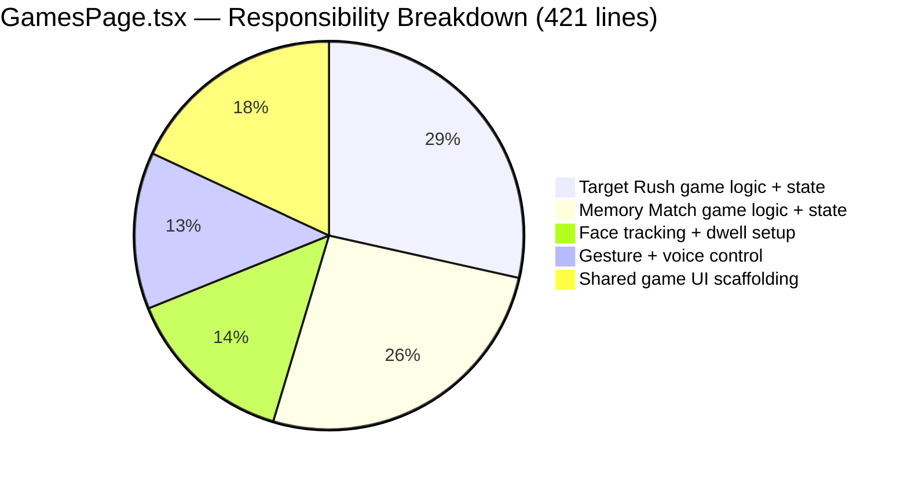
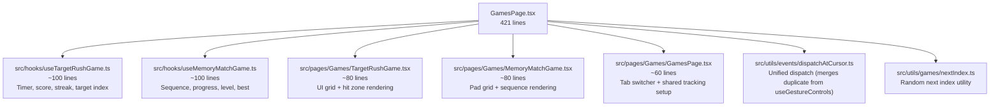

## 🟡 Priority: This Sprint

`src/pages/Games/GamesPage.tsx` is **421 lines** that embed two complete games (Target Rush and Memory Match), their state machines, face-tracking initialization, and gesture setup in a single page component.

---

## Problem Analysis

---

## Previous Work Referenced

- **Commit `e1bb5f9`** (@SanPranav + @aadibhat09): `"add games + smooth mouse changes"` — original commit that created `GamesPage.tsx`, embedding both games inline inside a single 400+ line file.
- **Issue #4** (Design Research, Problem 2): *"Gesture Controls — define gesture detection thresholds… establish debounce/cooldown windows."* — game-specific gesture thresholds are currently mixed into the shared page, making tuning error-prone.

Both the `dispatchAtCursor` function (lines 26–43) and the `nextIndex` helper (lines 17–23) are also duplicated with similar utilities in `useGestureControls.ts` and need to be unified.

---

## Proposed Split

---

## Acceptance Criteria

- [ ] `GamesPage.tsx` reduced to ≤ 80 lines (tab switcher + tracking initialization only)
- [ ] `useTargetRushGame.ts` contains all Target Rush game logic (timer, score, streak)
- [ ] `useMemoryMatchGame.ts` contains all Memory Match game logic (sequence, level, progress)
- [ ] `TargetRushGame.tsx` is a stateless (or nearly stateless) UI component
- [ ] `MemoryMatchGame.tsx` is a stateless (or nearly stateless) UI component
- [ ] `dispatchAtCursor` utility is consolidated into `src/utils/events/dispatchAtCursor.ts`
- [ ] `nextIndex` utility is extracted to `src/utils/games/nextIndex.ts`
- [ ] Both games play identically after refactor — no behavior regression

---

**Labels:** `srp-cleanup` `refactor` `this-sprint` `games`  
**Milestone:** SRP Cleanup Sprint — Q1 2026  
**References:** [KANBAN_BOARD.md — SRP-4](../../docs/KANBAN_BOARD.md#srp-4-refactor-gamespagetsxo)
