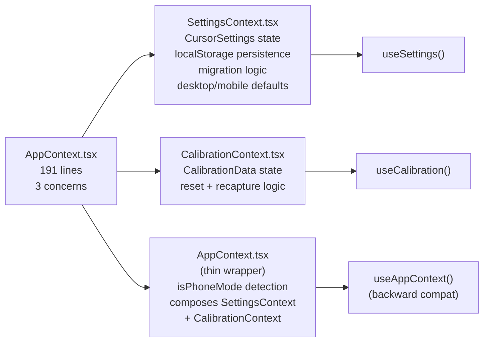

## 🟡 Priority: This Sprint

`src/context/AppContext.tsx` (191 lines) manages three orthogonal concerns in a single React context provider: **user settings** (40+ keys), **calibration data**, and **device detection** (`isPhoneMode`).

---

## Problem Analysis

```mermaid
erDiagram
  AppContext {
    CursorSettings settings "40+ keys"
    Function setSettings "with localStorage migration"
    CalibrationData calibration "5-point capture"
    Function setCalibration "independent lifecycle"
    boolean isPhoneMode "derived from userAgent"
  }

  CursorSettings {
    string cameraId
    boolean mirrorCamera
    number sensitivity
    number horizontalSensitivity
    number verticalSensitivity
    number deadzone
    number smoothing
    number dwellMs
    number dwellMoveTolerance
    number clickSensitivity
    number doubleBlinkWindowMs
    number consecutiveBlinkGapMs
    number longBlinkMs
    boolean stabilization
    boolean blinkEnabled
    boolean mouthEnabled
    int "...24 more keys"
  }

  CalibrationData {
    Point center
    Point left
    Point right
    Point up
    Point down
  }

  AppContext ||--|| CursorSettings : manages
  AppContext ||--|| CalibrationData : manages
  AppContext ||--o| boolean : derives_isPhoneMode
```

Settings and calibration have completely different lifecycles:
- **Settings** change frequently during a session (user adjusts sensitivity, toggles features)
- **Calibration** is set once per physical setup and rarely changed

Bundling them in the same context means any calibration re-render triggers settings consumers (and vice versa).

---

## Previous Work Referenced

- **Commit `e101865`** (@SanPranav + @aadibhat09): `"feat(settings): add granular sensitivity data model"` — grew `CursorSettings` from ~20 keys to 40+, making `AppContext` the single source of truth for an increasingly large settings object.
- **Commit `7406ddb`** (@SanPranav + @aadibhat09): `"add mobile implementation + improve styling + landing page"` — added `isPhoneMode` derived from `navigator.userAgent` and `mobileDefaultSettings` directly into `AppContext.tsx`, mixing device detection concerns into the settings context.
- **Issue #1** (Capstone Summary): Lists `AppContext` as managing all 40 settings — a sign the context has grown beyond a single responsibility.

---

## Proposed Split



---

## Acceptance Criteria

- [ ] `SettingsContext.tsx` manages only `CursorSettings` state + `localStorage` persistence + migration
- [ ] `CalibrationContext.tsx` manages only `CalibrationData` state + reset logic
- [ ] `AppContext.tsx` becomes a thin composite provider or is retired in favour of `useSettings()` and `useCalibration()`
- [ ] `useAppContext()` hook continues to work without breaking callers (backward-compatible shim if needed)
- [ ] `localStorage` key names preserved — no loss of stored user preferences on upgrade
- [ ] `isPhoneMode` correctly derived and available to consumers
- [ ] No unnecessary re-renders: a calibration update should not re-render settings consumers

---

**Labels:** `srp-cleanup` `refactor` `this-sprint` `state-management`  
**Milestone:** SRP Cleanup Sprint — Q1 2026  
**References:** [KANBAN_BOARD.md — SRP-5](../../docs/KANBAN_BOARD.md#srp-5-separate-appcontext-concerns)
