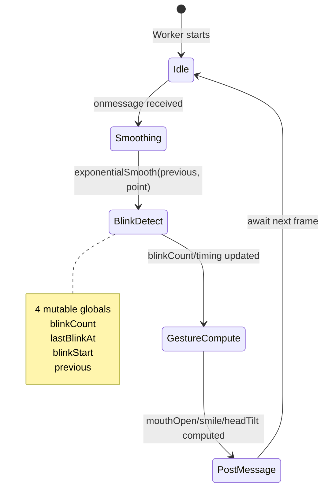
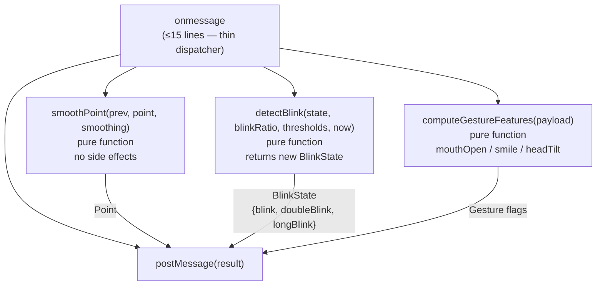

##  Priority: This Sprint

`src/workers/trackingWorker.ts` (65 lines) is compact but interleaves three concerns inside a single `onmessage` handler backed by mutable global variables (`blinkCount`, `lastBlinkAt`, `blinkStart`, `previous`).

---

## Problem Analysis



The current `onmessage` handler:
1. **Cursor smoothing** — calls `exponentialSmooth()` and updates `previous`
2. **Blink state machine** — tracks `blinkStart`, `blinkCount`, `lastBlinkAt` timing
3. **Gesture feature extraction** — computes `mouthOpen`, `smile`, `headTilt` thresholds

Each of these should be a pure function that takes state in and returns new state out — no side effects, no globals.

---

## Previous Work Referenced

- **Commit `8810507`** (@SanPranav): `"base"` — original worker file; blink state machine and smoothing interleaved in `onmessage` from the start.
- **Commit `0be341b`** (@SanPranav + @aadibhat09): `"feat(tracking): tune blink and gesture sensitivity behavior"` — added `doubleBlinkWindowMs` and `consecutiveBlinkGapMs` as configurable parameters, deepening the blink state machine within the same handler.
- **Issue #2** (@SanPranav, Task B): *"Validate default thresholds — blink sensitivity (`clickSensitivity`), `mouthOpen` threshold, `smile` threshold."* — threshold documentation is easier when the logic is in isolated, documented pure functions.

---

## Proposed Cleanup



```typescript
// Example: BlinkState interface (no globals)
interface BlinkState {
  blinkCount: number;
  lastBlinkAt: number;
  blinkStart: number;
}
```

---

## Acceptance Criteria

- [ ] `onmessage` handler ≤ 15 lines (thin dispatcher only)
- [ ] `smoothPoint(prev, point, smoothing)` extracted as a pure function
- [ ] `detectBlink(state, blinkRatio, thresholds, now)` extracted as a pure function returning `{ blink, doubleBlink, longBlink, newState: BlinkState }`
- [ ] `computeGestureFeatures(payload)` extracted as a pure function
- [ ] `BlinkState` interface introduced; no mutable global variables
- [ ] All pure functions have JSDoc comments documenting inputs and outputs
- [ ] Worker output is identical to before — no regression in blink or gesture detection

---

**Labels:** `srp-cleanup` `refactor` `this-sprint` `workers` `performance`  
**Milestone:** SRP Cleanup Sprint — Q1 2026  
**References:** [KANBAN_BOARD.md — SRP-6](../../docs/KANBAN_BOARD.md#srp-6-clean-up-trackingworkerts)
