#  NodCursor – Kanban Board & Burndown Tracker

> **Maintainers:** [@aadibhat09](https://github.com/aadibhat09) · [@SanPranav](https://github.com/SanPranav)  
> **Last updated:** March 2026 · **Sprint:** SRP Cleanup Sprint (Q1 2026)

---

##  Sprint Overview

This board tracks **SRP (Single Responsibility Principle) cleanup work** across the NodCursor codebase, plus upcoming features and next-steps. Each column represents the current state of every work item.

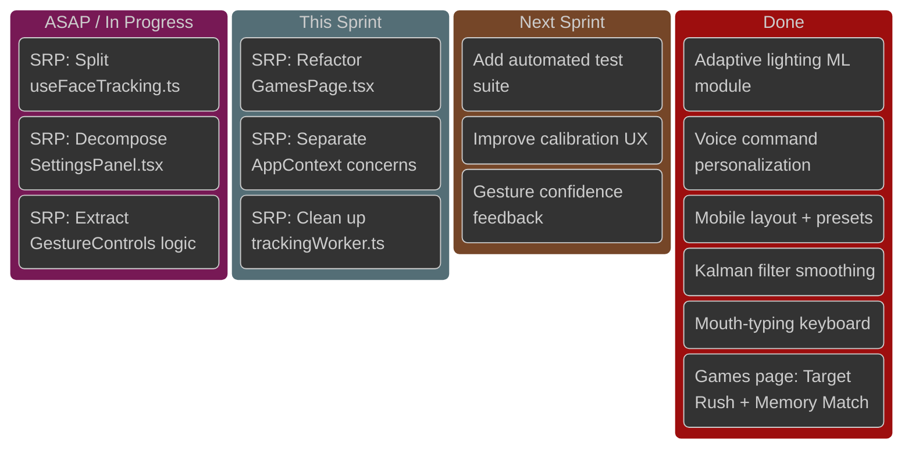

---

##  System Architecture

How NodCursor's components fit together — and where SRP violations currently live.

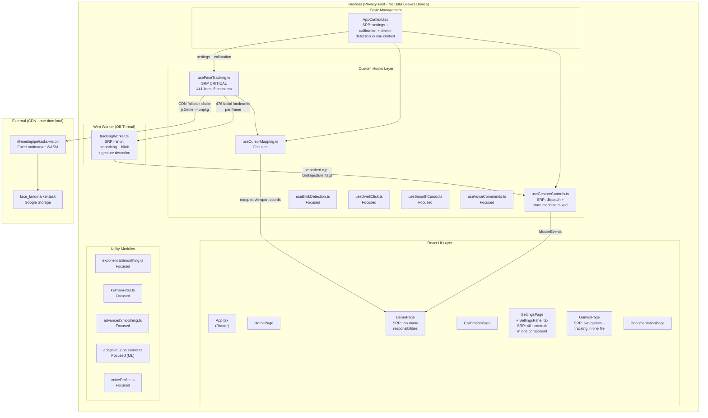

---

##  Burndown Chart — SRP Cleanup Sprint

> Estimated complexity: each SRP issue = 1 story point per 100 lines of code affected.
> Total story points this sprint: **~14 points**.

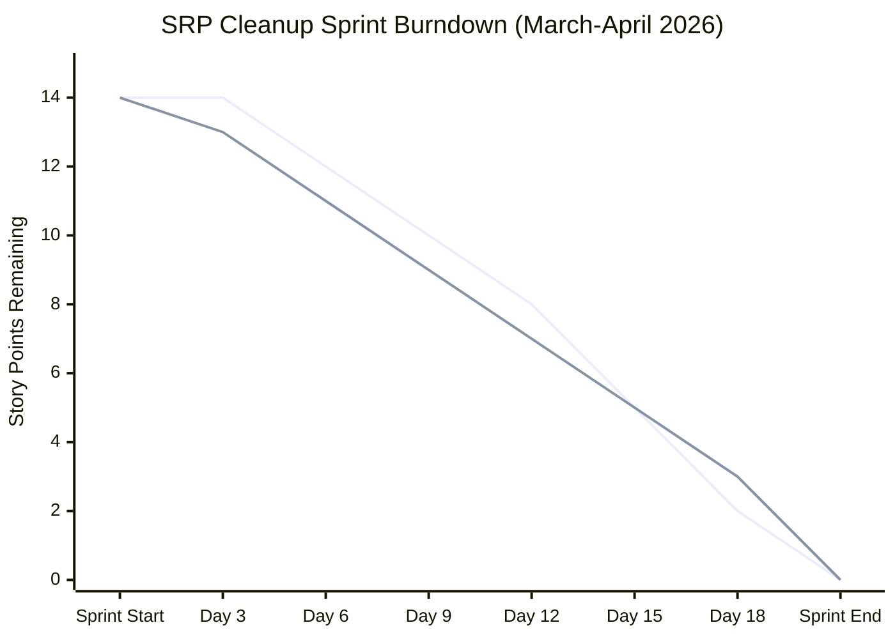

---

##  Sprint Timeline (Gantt)

```mermaid
gantt
  title NodCursor SRP Cleanup Sprint - Q1 2026
  dateFormat  YYYY-MM-DD
  section  ASAP (Priority 1)
    SRP: Split useFaceTracking.ts          :crit, active, srp1, 2026-03-24, 5d
    SRP: Decompose SettingsPanel.tsx        :crit, active, srp2, 2026-03-24, 3d
    SRP: Extract GestureControls logic      :crit, srp3, after srp2, 3d
  section  This Sprint (Priority 2)
    SRP: Refactor GamesPage.tsx             :srp4, after srp1, 4d
    SRP: Separate AppContext concerns       :srp5, after srp3, 3d
    SRP: Clean up trackingWorker.ts         :srp6, after srp4, 2d
  section  Next Sprint (Priority 3)
    Add automated test suite                :test1, 2026-04-07, 7d
    Improve calibration UX                  :ux1, 2026-04-07, 5d
    Gesture confidence feedback             :ux2, after ux1, 4d
  section  Completed (Previous Work)
    Adaptive lighting ML module             :done, ml1, 2026-03-10, 7d
    Voice command personalization           :done, vc1, 2026-03-05, 5d
    Mobile layout + presets                 :done, mob1, 2026-03-01, 4d
    Mouth-typing keyboard                   :done, mt1, 2026-02-20, 6d
    Games: Target Rush + Memory Match       :done, gm1, 2026-02-15, 5d
```

---

##  Issue Index

| # | Title | Priority | Assignee | Status |
|---|-------|----------|----------|--------|
| [SRP-1](#srp-1-split-usefacetrackingts) | SRP: Split `useFaceTracking.ts` into focused hooks |  ASAP | @aadibhat09 |  In Progress |
| [SRP-2](#srp-2-decompose-settingspaneltsx) | SRP: Decompose `SettingsPanel.tsx` into sub-components |  ASAP | @SanPranav |  In Progress |
| [SRP-3](#srp-3-extract-gesturecontrols-logic) | SRP: Extract gesture dispatch from `useGestureControls.ts` |  ASAP | @aadibhat09 |  To Do |
| [SRP-4](#srp-4-refactor-gamespagetsxo) | SRP: Refactor `GamesPage.tsx` - separate game logic from UI |  This Sprint | @SanPranav |  To Do |
| [SRP-5](#srp-5-separate-appcontext-concerns) | SRP: Separate `AppContext.tsx` concerns |  This Sprint | @aadibhat09 |  To Do |
| [SRP-6](#srp-6-clean-up-trackingworkerts) | SRP: Clean up `trackingWorker.ts` responsibility boundary |  This Sprint | @SanPranav |  To Do |
| [NEXT-1](#next-1-automated-test-suite) | Add automated test suite (Vitest + Testing Library) |  Next Sprint | @aadibhat09 |  Backlog |
| [NEXT-2](#next-2-calibration-ux-improvements) | Calibration UX improvements + edge-case handling |  Next Sprint | @SanPranav |  Backlog |
| [NEXT-3](#next-3-gesture-confidence-feedback) | Gesture confidence feedback system |  Next Sprint | @aadibhat09 |  Backlog |

---

##  ASAP Issues

### SRP-1: Split `useFaceTracking.ts`

> **Priority:**  ASAP | **Assignee:** @aadibhat09 | **Effort:** ~4 story points

**What's wrong:**

`src/hooks/useFaceTracking.ts` (441 lines) is the most critical SRP violation in the codebase. It currently handles **6 distinct responsibilities** in a single file:

```mermaid
mindmap
  root((useFaceTracking.ts))
    MediaPipe Loading
      CDN fallback chain
      FilesetResolver WASM
      FaceLandmarker model init
    Camera Management
      requestCameraStream()
      device enumeration
      error message formatting
    Adaptive Lighting
      AdaptiveLightLearner integration
      tuneCameraForRecommendation()
      sampleVideoLuma() calls
    Landmark Extraction
      nose / eye / mouth ratios
      blinkRatio computation
      headTilt calculation
    Web Worker Coordination
      Worker lifecycle management
      message passing to trackingWorker
      state commit throttling
    Fallback Mouse Mode
      mouse tracking fallback
      outlier detection
      confidence scoring
```

**Cited previous work:**
- Commit `395abcd` (SanPranav + aadibhat09): `"add ML + fix calibration and cameras + develop better tracking default sens change"` — introduced `AdaptiveLightLearner` directly into `useFaceTracking.ts` at lines 6, 73–110, expanding an already large hook.
- Commit `0be341b` (SanPranav + aadibhat09): `"feat(tracking): tune blink and gesture sensitivity behavior"` — added blink sensitivity tuning inside the same hook.

**Proposed split:**

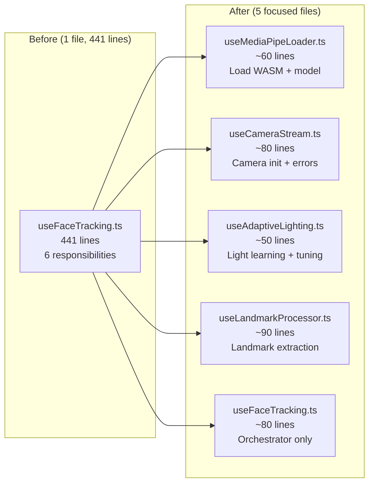

**Acceptance criteria:**
- [ ] `useFaceTracking.ts` ≤ 100 lines (orchestrator role only)
- [ ] `useMediaPipeLoader.ts` handles only MediaPipe WASM loading with CDN fallback
- [ ] `useCameraStream.ts` handles only camera stream acquisition and device enumeration
- [ ] `useAdaptiveLighting.ts` handles only `AdaptiveLightLearner` + `tuneCameraForRecommendation`
- [ ] `useLandmarkProcessor.ts` handles only landmark index extraction and ratio computation
- [ ] All existing behavior preserved; no regression in tracking quality

---

### SRP-2: Decompose `SettingsPanel.tsx`

> **Priority:**  ASAP | **Assignee:** @SanPranav | **Effort:** ~3 story points

**What's wrong:**

`src/components/SettingsPanel/SettingsPanel.tsx` (321 lines) renders **40+ settings controls** as a monolithic component. A change to any single setting group requires loading the entire panel:

```mermaid
block-beta
  columns 1
  block:PANEL["SettingsPanel.tsx — 321 lines — single component"]:1
    A["Cursor Speed (lines 19–29)"]
    B["Horizontal Sensitivity (lines 30–40)"]
    C["Vertical Sensitivity (lines 41–53)"]
    D["Acceleration (lines 54–65)"]
    E["Smoothing (lines 66+)"]
    F["Deadzone"]
    G["Dwell timing (dwellMs, dwellMoveTolerance)"]
    H["Blink params (clickSensitivity, doubleBlinkWindowMs,\nconsecutiveBlinkGapMs, longBlinkMs)"]
    I["Mouth params (mouthEnabled, cooldowns)"]
    J["Head tilt scroll (threshold, step, cooldown)"]
    K["Camera selection dropdown"]
    L["Voice settings"]
  end
```

**Cited previous work:**
- Commit `34906f6` (SanPranav + aadibhat09): `"feat(ui): add advanced sensitivity controls and presets"` — added horizontal/vertical sensitivity sliders and acceleration curve to `SettingsPanel.tsx`, making it grow significantly.
- Commit `e101865` (SanPranav + aadibhat09): `"feat(settings): add granular sensitivity data model"` — expanded `CursorSettings` type to include `horizontalSensitivity`, `verticalSensitivity`, `acceleration`, increasing the number of controls in the panel.

**Proposed decomposition:**

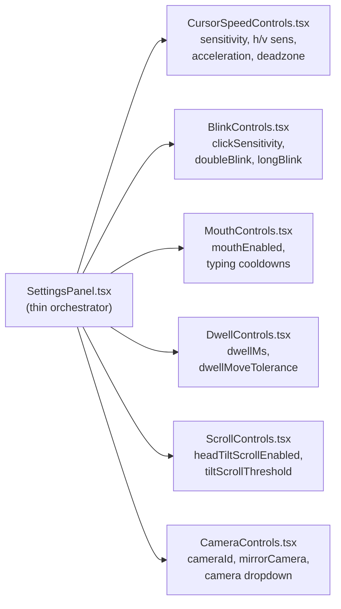

**Acceptance criteria:**
- [ ] `SettingsPanel.tsx` ≤ 60 lines (renders sub-components only)
- [ ] Each sub-component handles only one logical settings group
- [ ] All settings still bind correctly to `AppContext`; no behavior regression
- [ ] Sub-components are individually testable in isolation

---

### SRP-3: Extract Gesture Dispatch from `useGestureControls.ts`

> **Priority:**  ASAP | **Assignee:** @aadibhat09 | **Effort:** ~2 story points

**What's wrong:**

`src/hooks/useGestureControls.ts` (177 lines) conflates two concerns: **blink/gesture state transition tracking** and **DOM mouse event dispatching**. These should never be in the same module.

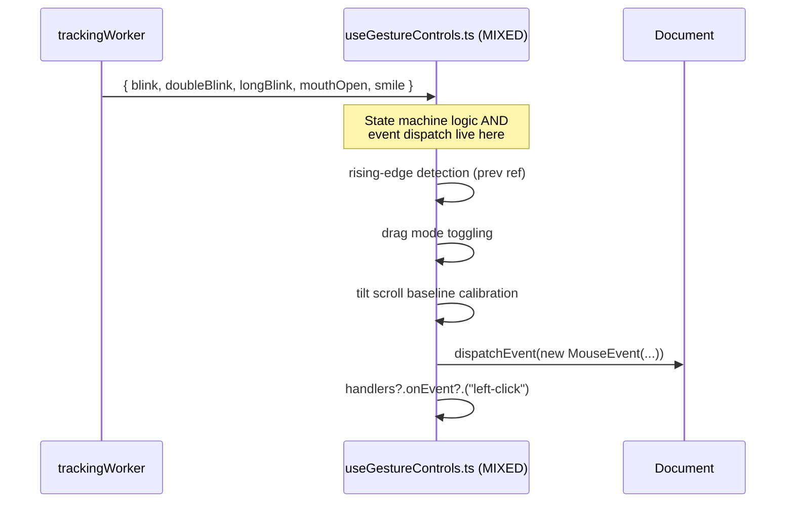

**Cited previous work:**
- Commit `7ac89ed` (SanPranav + aadibhat09): `"added mouth typing + gesture controls"` — original commit that created `useGestureControls.ts` mixing state machine and dispatch together.
- Issue #3 (aadibhat09): Task A — *"Gesture dispatch hardening (reduce accidental triggers)"* — explicitly calls out the need to review the `contextmenu` dispatch and drag-mode toggling in this exact file.

**Proposed extraction:**

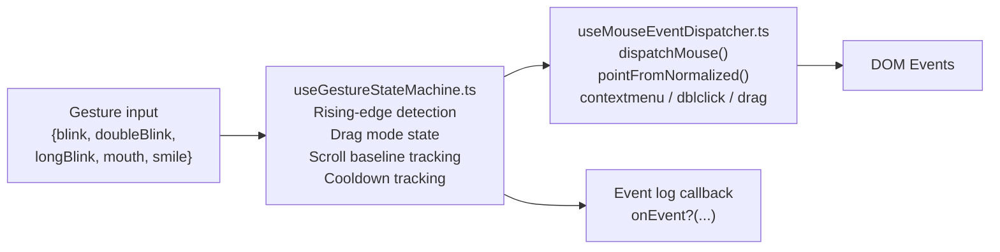

**Acceptance criteria:**
- [ ] `useMouseEventDispatcher.ts` contains all `dispatchEvent` / `MouseEvent` logic
- [ ] `useGestureControls.ts` or a new `useGestureStateMachine.ts` handles rising-edge detection only
- [ ] No accidental double-dispatching introduced by the refactor
- [ ] Drag mode and tilt scroll still function correctly

---

##  This Sprint

### SRP-4: Refactor `GamesPage.tsx`

> **Priority:**  This Sprint | **Assignee:** @SanPranav | **Effort:** ~3 story points

**What's wrong:**

`src/pages/Games/GamesPage.tsx` (421 lines) embeds **two complete mini-games**, their state machines, and face-tracking initialization in a single page component.

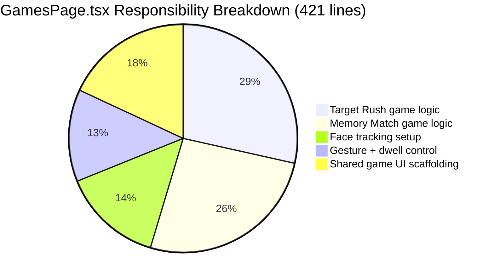

**Cited previous work:**
- Commit `e1bb5f9` (SanPranav + aadibhat09): `"add games + smooth mouse changes"` — introduced the entire `GamesPage.tsx`, embedding both games inline.

**Proposed split:**
- `src/hooks/useTargetRushGame.ts` — Target Rush game state + timer logic
- `src/hooks/useMemoryMatchGame.ts` — Memory Match sequence + level logic
- `src/pages/Games/TargetRushGame.tsx` — Target Rush UI (stateless/nearly)
- `src/pages/Games/MemoryMatchGame.tsx` — Memory Match UI
- `src/pages/Games/GamesPage.tsx` — Tab switcher + shared tracking setup (~60 lines)

**Acceptance criteria:**
- [ ] `GamesPage.tsx` ≤ 80 lines (renders game components, initializes tracking)
- [ ] Each game's logic is independently unit-testable without a browser
- [ ] `dispatchAtCursor` utility extracted to `src/utils/events/dispatchAtCursor.ts`
- [ ] `nextIndex` utility extracted to `src/utils/games/nextIndex.ts`

---

### SRP-5: Separate `AppContext.tsx` Concerns

> **Priority:**  This Sprint | **Assignee:** @aadibhat09 | **Effort:** ~2 story points

**What's wrong:**

`src/context/AppContext.tsx` (191 lines) manages three orthogonal concerns in one context provider:
1. **Settings** (40+ keys, desktop vs. mobile defaults, `localStorage` migration)
2. **Calibration data** (independent lifecycle from settings)
3. **Device detection** (`isPhoneMode` — derived from `navigator.userAgent`)

```mermaid
erDiagram
  AppContext {
    CursorSettings settings
    Function setSettings
    CalibrationData calibration
    Function setCalibration
    boolean isPhoneMode
  }

  CursorSettings {
    string cameraId
    boolean mirrorCamera
    number sensitivity
    number horizontalSensitivity
    number verticalSensitivity
    number deadzone
    number smoothing
    number dwellMs
    number clickSensitivity
    number doubleBlinkWindowMs
    number consecutiveBlinkGapMs
    number longBlinkMs
    boolean blinkEnabled
    boolean mouthEnabled
    number acceleration
    int 40_total_keys
  }

  CalibrationData {
    Point center
    Point left
    Point right
    Point up
    Point down
  }

  AppContext ||--|| CursorSettings : contains
  AppContext ||--|| CalibrationData : contains
  AppContext ||--o| boolean : isPhoneMode
```

**Cited previous work:**
- Commit `e101865` (SanPranav + aadibhat09): `"feat(settings): add granular sensitivity data model"` — grew `CursorSettings` from ~20 keys to 40+, making `AppContext` even more complex.
- Commit `7406ddb` (SanPranav + aadibhat09): `"add mobile implementation + improve styling"` — added `isPhoneMode` and `mobileDefaultSettings` to `AppContext`, mixing device detection into the same provider.

**Proposed split:**
- `SettingsContext.tsx` — settings state + localStorage persistence + migration
- `CalibrationContext.tsx` — calibration data + reset logic
- `AppContext.tsx` — re-export `isPhoneMode` only (or merge into `SettingsContext`)

**Acceptance criteria:**
- [ ] Settings and calibration are managed by separate context providers
- [ ] No breaking changes to any hook that currently reads from `AppContext`
- [ ] `localStorage` key names preserved to avoid resetting user preferences
- [ ] `useAppContext()` hook continues to work via a composite provider

---

### SRP-6: Clean Up `trackingWorker.ts`

> **Priority:**  This Sprint | **Assignee:** @SanPranav | **Effort:** ~1 story point

**What's wrong:**

`src/workers/trackingWorker.ts` (65 lines) is compact but mixes **cursor smoothing**, **blink state machine**, and **gesture feature computation** inside a single `onmessage` handler with mutable global state:

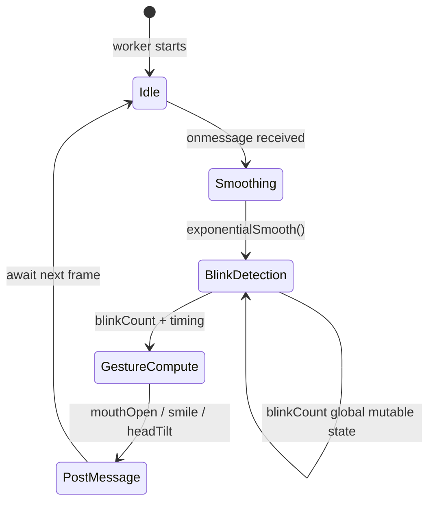

**Cited previous work:**
- Commit `8810507` (SanPranav): `"base"` — original worker file; blink state machine and smoothing interleaved in `onmessage`.
- Commit `0be341b` (SanPranav + aadibhat09): `"feat(tracking): tune blink and gesture sensitivity behavior"` — added `doubleBlinkWindowMs` and `consecutiveBlinkGapMs` parameters, deepening the state machine within the same handler.

**Proposed cleanup:**
- Extract `smoothPoint(prev, point, smoothing)` as a pure function
- Extract `detectBlink(state, blinkRatio, thresholds, now)` as a pure function returning new state
- Extract `computeGestureFeatures(payload)` as a pure function
- Keep `onmessage` as a thin dispatcher calling these functions

**Acceptance criteria:**
- [ ] `onmessage` handler ≤ 15 lines
- [ ] Blink state extracted into a `BlinkState` interface with no global mutable variables
- [ ] All pure functions have JSDoc comments describing inputs/outputs
- [ ] Worker behavior is identical; no regression in blink detection

---

##  Next Sprint Backlog

### NEXT-1: Automated Test Suite

> **Priority:**  Next Sprint | **Assignee:** @aadibhat09 | **Effort:** ~5 story points

NodCursor currently has **zero automated tests**. The SRP refactor (above) is a prerequisite because isolated, pure functions are far easier to unit-test.

**Proposed test strategy:**

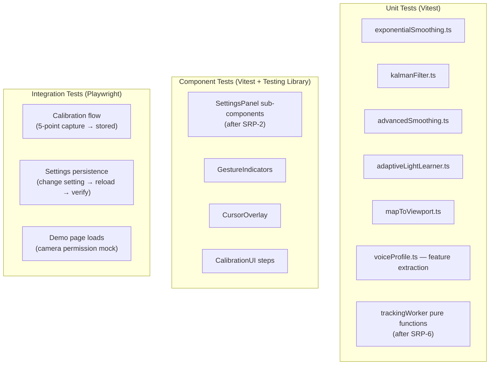

---

### NEXT-2: Calibration UX Improvements

> **Priority:**  Next Sprint | **Assignee:** @SanPranav | **Effort:** ~3 story points

Cited from **Issue #2** (SanPranav's weekly issue, Task C): *"Add/verify user feedback for incomplete calibration data... Ensure mapping always clamps to [0..1] and avoids NaN/undefined cases."*

**Work items:**
- [ ] Show explicit error if a calibration point was not captured
- [ ] Validate `mapToViewport` output is always clamped `[0, 1]` with no NaN
- [ ] Add re-calibration prompt when head position drifts significantly
- [ ] Progressive disclosure: show calibration quality score after capture

---

### NEXT-3: Gesture Confidence Feedback

> **Priority:**  Next Sprint | **Assignee:** @aadibhat09 | **Effort:** ~2 story points

Cited from **Issue #3** (aadibhat09's weekly issue, Task B): *"Add visible state indicators — Drag mode: On/Off; Gestures enabled: yes/no"*

Cited from **Issue #4** (Design Research): *"Users prefer gesture confirmation feedback (visual/audio) over silent action dispatch."*

**Work items:**
- [ ] Visual flash/pulse on gesture indicator when blink is registered
- [ ] "Drag mode: ON" persistent status badge
- [ ] Audio cue option (short tone) for confirmed click
- [ ] `onEvent` callback from `useGestureControls` surfaced to Demo UI log panel

---

##  Completed Work

The following items were completed in previous sprints and are documented here for sprint velocity reference.

| Commit | Author | Contribution |
|--------|--------|-------------|
| `395abcd` | @SanPranav + @aadibhat09 | Adaptive lighting ML (`AdaptiveLightLearner`), calibration fixes, camera tuning |
| `c3cab5c` | @SanPranav | Refactor: remove duplicate imports in `SettingsPage` |
| `854946e` | @SanPranav + @aadibhat09 | Vite preview host hardening |
| `da9fed7` | @SanPranav + @aadibhat09 | API docs refresh + TYPING_SYSTEM.md + WHY_WE_STARTED.md |
| `8e6a254` | @SanPranav + @aadibhat09 | Routed documentation sections (blog-style docs) |
| `292ed89` | @SanPranav + @aadibhat09 | Mouth typing flow optimization |
| `34906f6` | @SanPranav + @aadibhat09 | Advanced sensitivity controls + presets (h/v sensitivity, acceleration) |
| `0be341b` | @SanPranav + @aadibhat09 | Blink + gesture sensitivity tuning |
| `e101865` | @SanPranav + @aadibhat09 | Granular sensitivity data model |
| `7406ddb` | @SanPranav + @aadibhat09 | Mobile implementation + landing page + smooth scrolling |
| `7c3fb1d` | @SanPranav + @aadibhat09 | Voice cursor integration |
| `e1bb5f9` | @SanPranav + @aadibhat09 | Games page (Target Rush + Memory Match) + smooth mouse |
| `7ac89ed` | @SanPranav + @aadibhat09 | Mouth typing + gesture controls |
| `438f74d` | @SanPranav + @aadibhat09 | Documentation upgrade + tongue control exploration |
| `dbd4bbf` | @SanPranav + @aadibhat09 | Smooth cursor + deployment fix |
| `cec7a2e` | @aadibhat09 | Initial commit |

---

##  Velocity Tracker

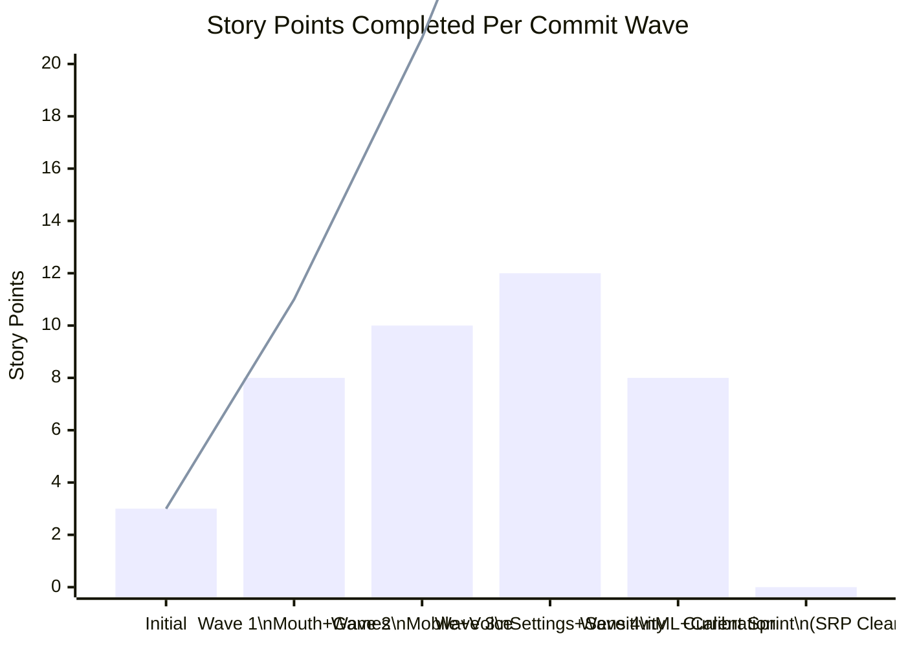

---

##  SRP Diagnosis Summary

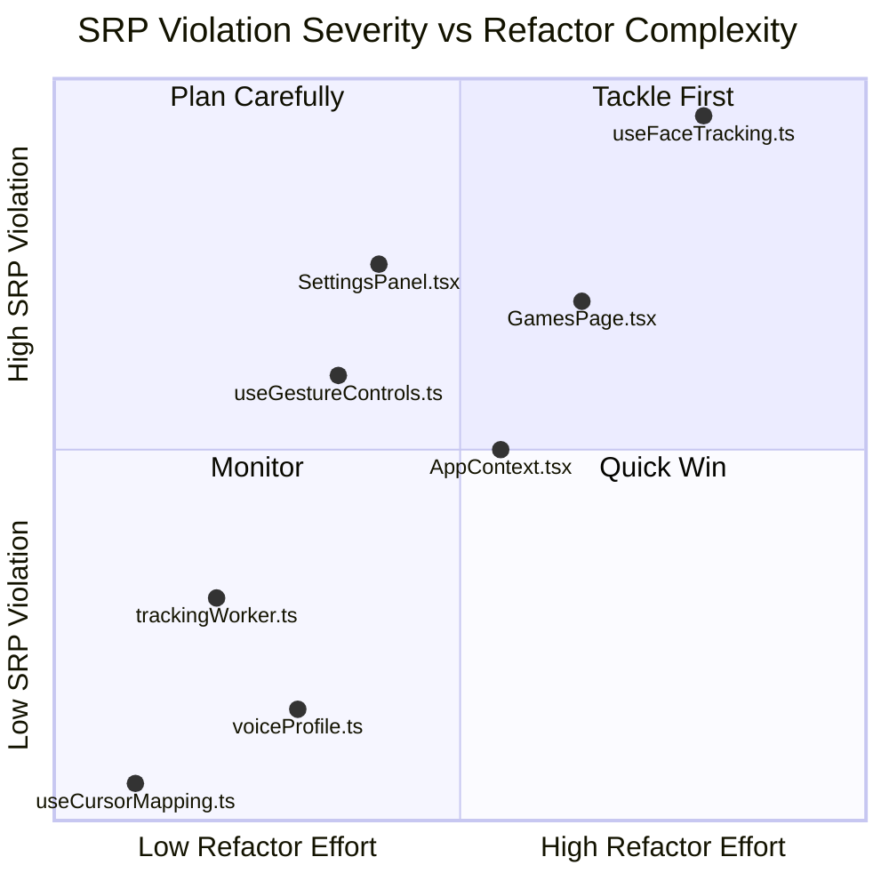

---

*Maintained by [@aadibhat09](https://github.com/aadibhat09) and [@SanPranav](https://github.com/SanPranav) — NodCursor Capstone Project, Q1 2026.*
